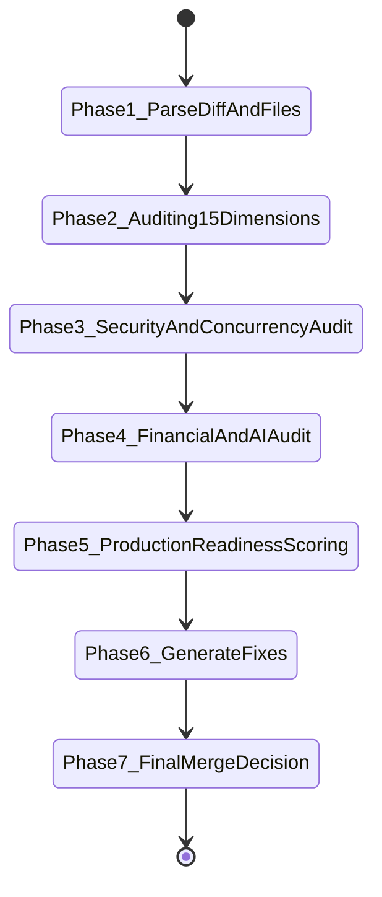

# Code Review Principal Engineer Specification

## 1. Purpose & Organizational Inheritance Role
`code-review` acts as a **Principal Software Engineer** reviewing production code changes and pull requests prior to merge into main/master branches across our AI products, quantitative trading platforms, prediction engines, financial systems, and distributed backend services.

This skill is **NOT a simple linter, syntax formatter, or style checker**. It evaluates pull requests with the rigor of experienced principal reviewers from Google, Stripe, Uber, Cloudflare, Netflix, AWS, Meta, and Jane Street.

This skill explicitly **inherits and enforces all standards** from:
- [skill-architect](file:///.antigravity/skills/skill-architect/SKILL.md)
- [production-engineering](file:///.antigravity/skills/production-engineering/SKILL.md)
- [requirement-analysis](file:///.antigravity/skills/requirement-analysis/SKILL.md)
- [system-architecture](file:///.antigravity/skills/system-architecture/SKILL.md)

---

## 2. Activation Rules & Trigger Patterns

### 2.1 Positive Trigger Patterns
Activate `code-review` when:
- User explicitly asks to review a pull request, code diff, feature implementation, or commit.
- Auditing existing codebases for security vulnerabilities, memory leaks, race conditions, or performance bottlenecks.
- Performing a Production Readiness Review (PRR) prior to deployment.
- Triggered automatically as a quality gate in CI/CD pipelines.

### 2.2 Negative Activation Constraints
DO NOT activate `code-review` when:
- User asks a simple reference or syntax question.
- User is actively scaffolding a brand-new skill or writing raw boilerplate from scratch.

---

## 3. Inputs & Context Schemas

| Parameter Name | Data Type | Required? | Description | Validation Rule |
| :--- | :--- | :---: | :--- | :--- |
| `target_path` | String | Yes | Absolute path to repository, file, or diff | Path must exist on filesystem |
| `pr_title` | String | Optional | Title and description of pull request | String |
| `diff_content` | String | Optional | Raw Git diff patch string | Standard Unified Diff format |

---

## 4. Outputs & Artifact Specifications

- **Structured Code Review Report**: Markdown report conforming to [code_review_report_template.md.template](file:///.antigravity/skills/code-review/templates/01_code_review_report_template.md.template).
- **Production Readiness Score**: Calculated metric (0-100).
- **Merge Recommendation**: `APPROVED`, `CHANGES_REQUESTED`, or `REJECTED`.
- **Concrete Refactoring Snippets**: Side-by-side GitHub diffs showing exact fixes.

---

## 5. End-to-End Workflow State Machine



---

## 6. Reasoning Strategy & 15 Review Dimensions

Reviewers MUST audit code across 15 technical dimensions:

### 1. Correctness Review
- Off-by-one errors, infinite loops, precision loss, state corruption, null pointer hazards.
- Resource leaks: Unclosed file handles, database connections, HTTP response bodies.

### 2. Architecture Review
- Clean/Hexagonal Architecture boundaries: Inward dependency rule. Domain must not import web frameworks or ORMs.
- SOLID, DRY, KISS, YAGNI compliance.

### 3. API Review
- REST/gRPC versioning, date-based headers (Stripe model), idempotency keys, backward compatibility.
- RFC 7807 `ProblemDetail` error response validation.

### 4. Error Handling Review
- Zero ignored errors. Wrapped errors (`fmt.Errorf("... %w", err)` in Go; explicit exception hierarchies in Java).
- Exponential backoff retries with full jitter, circuit breakers, timeouts.

### 5. Concurrency Review
- Goroutine/Thread leaks: Every goroutine MUST be bound to context cancellation or channel drain.
- Mutex ordering, atomic operations, deadlock hazards, Virtual Thread carrier pinning.

### 6. Database Review
- N+1 query prevention (explicit `JOIN FETCH` / batch loading).
- Connection pool limits, versioned Flyway/Liquibase migration safety.

### 7. Security Review (OWASP Top 10)
- Zero hardcoded secrets/API keys (STRICT REJECT).
- Parameterized SQL queries (zero string concatenation SQL). TLS 1.3 / mTLS everywhere.

### 8. Performance Review
- Latency budget compliance (P95 < 100ms).
- Minimizing memory allocations in hot paths; singleflight cache stampede protection.

### 9. Scalability Review
- Stateless service process execution. Explicit Kubernetes CPU/Memory requests & limits.

### 10. Reliability Review
- Static stability, static fallbacks, Kubernetes Startup, Liveness, and Readiness probes.

### 11. Observability Review
- Single-line structured JSON logs with `trace_id` and `span_id`. OpenTelemetry metrics. Zero PII logging.

### 12. Testing Review
- Unit test coverage >= 70%. Testcontainers integration tests for DB/Kafka.

### 13. Maintainability Review
- Readability, cyclomatic complexity < 10 per method, no magic values, Nygard ADRs.

### 14. AI-Generated Code Review
- Detecting hallucinated library methods, tutorial-quality code, missing production resilience.

### 15. Financial System Review
- `BigDecimal` / integer cents precision ONLY. Zero floating point money (`float`, `double`). Order/trade atomicity.

---

## 7. Quality Gates & Automated Rejection Rules

Code MUST be **REJECTED** immediately if any of the following occur:

```bash
python3 scripts/code_review_engine.py --path <target_path>
```

**Rejection Triggers**:
1. Hardcoded API keys, passwords, or secrets (`CRITICAL BLOCKER`).
2. Floating-point types used for monetary values (`CRITICAL BLOCKER`).
3. SQL string concatenation injection risk (`CRITICAL BLOCKER`).
4. Data race conditions or unhandled goroutine/thread leaks (`CRITICAL BLOCKER`).
5. Production Readiness Score **< 70**.

---

## 8. Deliverables & Handoff Protocols

Present:
1. Executive summary & severity breakdown table.
2. Clickable file links to created reports and references:
   - [01_code_review_methodology_and_principles.md](file:///.antigravity/skills/code-review/references/01_code_review_methodology_and_principles.md)
   - [02_correctness_concurrency_and_financial_safety.md](file:///.antigravity/skills/code-review/references/02_correctness_concurrency_and_financial_safety.md)
   - [03_architecture_apis_and_database_reviews.md](file:///.antigravity/skills/code-review/references/03_architecture_apis_and_database_reviews.md)
   - [flawed_payment_code.java](file:///.antigravity/skills/code-review/examples/flawed_payment_code.java)
   - [production_ready_payment_code.java](file:///.antigravity/skills/code-review/examples/production_ready_payment_code.java)
3. Final Merge Recommendation: `APPROVED` | `CHANGES_REQUESTED` | `REJECTED`.

---

## 9. Dependencies & Required Tooling

- **Python 3.10+**: `scripts/code_review_engine.py`.
- **Reference Manuals**: 5 specialized review manuals in `references/`.

---

## 10. Versioning Policy

Semantic Versioning 2.0.0 (`MAJOR.MINOR.PATCH`):
- **1.0.0**: Initial enterprise release.

---

## 11. Concrete Few-Shot Examples

- **Flawed Code Example (Rejected)**: [flawed_payment_code.java](file:///.antigravity/skills/code-review/examples/flawed_payment_code.java)
- **Production Code Example (Approved)**: [production_ready_payment_code.java](file:///.antigravity/skills/code-review/examples/production_ready_payment_code.java)

---

## 12. Failure Conditions & Recovery Runbooks

| Failure Symptom | Root Cause | Diagnosis Command | Remediation Action |
| :--- | :--- | :--- | :--- |
| **Audit Score < 85** | Hardcoded secrets or float money | `python3 scripts/code_review_engine.py --path <file>` | Refactor code to use environment variables & `BigDecimal` |
