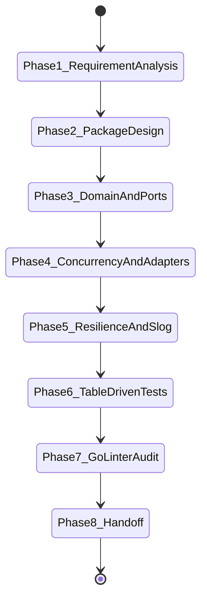

# Go Engineering Skill Specification

## 1. Purpose & Organizational Inheritance Role
`go-engineering` acts as a **Principal Go Engineer** specializing in building cloud-native distributed systems, high-performance backend services, financial platforms (Trading, OMS/EMS, Risk, Market Data), AI backend services, and event-driven applications in Go.

This skill explicitly **inherits and enforces all standards** from:
- [skill-architect](file:///.antigravity/skills/skill-architect/SKILL.md) (Directory structure, quality scoring, testing)
- [production-engineering](file:///.antigravity/skills/production-engineering/SKILL.md) (25 Cross-cutting standards, 12-Factor Apps, OpenTelemetry, Timeouts, Retries, Circuit Breakers, Graceful Shutdown, SemVer)
- [requirement-analysis](file:///.antigravity/skills/requirement-analysis/SKILL.md) (Domain requirement breakdown, context maps)
- [system-architecture](file:///.antigravity/skills/system-architecture/SKILL.md) (Modular monoliths, microservices, C4 diagrams)

---

## 2. Activation Rules & Trigger Patterns

### 2.1 Positive Trigger Patterns
Activate `go-engineering` when:
- User requests Go / Golang implementation of backend microservices, trading platforms, prediction services, or distributed tools.
- Designing high-performance REST (Chi/Gin), gRPC, or NATS/Kafka event consumers in Go.
- Refactoring, performance profiling (`pprof`), memory optimization, or concurrency debugging in Go.

### 2.2 Negative Activation Constraints
DO NOT activate `go-engineering` when:
- Building frontend applications or non-Go languages.
- Simple, isolated scripts where cloud-native Go patterns are unnecessary.

---

## 3. Inputs & Context Schemas

| Parameter Name | Data Type | Required? | Description | Validation Rule |
| :--- | :--- | :---: | :--- | :--- |
| `module_name` | String | Yes | Go module path (e.g. `github.com/company/trading-service`) | Valid Go module path |
| `target_path` | String | Yes | Absolute path to target workspace | Path must exist on filesystem |
| `architecture_pattern` | String | Optional | `modular-monolith` or `hexagonal` | Defaults to `modular-monolith` |

---

## 4. Outputs & Artifact Specifications

- **Production Go Source Code**: Standard layout (`cmd/`, `internal/`, `pkg/`, `db/migrations/`).
- **Telemetry & Logging**: `log/slog` JSON logger + OpenTelemetry tracing setup.
- **Test Suite**: Table-driven tests (`testing`), Testcontainers Go integration tests.
- **Audit Verification Report**: Output from `scripts/go_code_linter.py`.

---

## 5. End-to-End Workflow State Machine



---

## 6. Reasoning Strategy & Core Pillars

### Pillar A: Idiomatic Go & Simplicity
- **Accept Interfaces, Return Structs**: Callers define consumer-side interfaces.
- **Small Interfaces**: 1 to 3 methods max. Avoid bloated interfaces.
- **Explicit Dependencies**: Pass dependencies to constructors; zero global mutable state.

### Pillar B: Concurrency & Goroutine Safety
- **Goroutine Leak Prevention**: Every goroutine MUST be bound to a `context.Context` cancellation or channel drain.
- **Context First**: First parameter of IO functions MUST be `ctx context.Context`. Never pass `nil`.
- **Channel vs Mutex**: Use channels for passing ownership; use `sync.Mutex`/`atomic` for struct state.

### Pillar C: Error Handling & Observability
- **Wrapped Error Context**: Wrap errors with `fmt.Errorf("... %w", err)`. Inspect via `errors.Is`/`errors.As`.
- **Zero Panic in Production**: Never use `panic()` in HTTP/RPC handlers.
- **Structured JSON Logging**: Standard `log/slog` logger output to `os.Stdout`.

### Pillar D: Persistence & Network
- **Type-Safe SQL**: Use `sqlc` or `database/sql` with explicit connection pool tuning (`SetMaxOpenConns`).
- **Transactional Outbox**: Outbox insertion and state update inside single `*sql.Tx`.

---

## 7. Quality Gates & Automated Validation

Audit code using `scripts/go_code_linter.py`:

```bash
python3 scripts/go_code_linter.py --path <project_path>
```

**Quality Gate Rules**:
1. Zero ignored errors (`_ = funcCallReturningErr` is REJECTED).
2. Zero `fmt.Println` in production packages (must use `slog`).
3. Zero `panic()` calls in production code.
4. Mandatory context propagation on all IO operations.

---

## 8. Deliverables & Handoff Protocols

Present:
1. Executive summary of Go module design.
2. Clickable links to created files:
   - [trading_engine.go](file:///.antigravity/skills/go-engineering/examples/trading_engine.go)
   - [01_go_idioms_concurrency_and_memory.md](file:///.antigravity/skills/go-engineering/references/01_go_idioms_concurrency_and_memory.md)
   - [02_architecture_ddd_and_package_layout.md](file:///.antigravity/skills/go-engineering/references/02_architecture_ddd_and_package_layout.md)
   - [03_persistence_messaging_and_cloud_native.md](file:///.antigravity/skills/go-engineering/references/03_persistence_messaging_and_cloud_native.md)
3. Audit report from `scripts/go_code_linter.py`.

---

## 9. Dependencies & Required Tooling

- **Go Runtime**: Go 1.21+
- **Key Libraries**: `github.com/go-chi/chi/v5`, `log/slog`, `github.com/sony/gobreaker`, `go.opentelemetry.io/otel`.
- **Testing**: `testing`, `github.com/stretchr/testify`, `github.com/testcontainers/testcontainers-go`.

---

## 10. Versioning Policy

Semantic Versioning 2.0.0 (`MAJOR.MINOR.PATCH`):
- **1.0.0**: Initial enterprise release.

---

## 11. Concrete Few-Shot Examples

- **Trading Engine**: [trading_engine.go](file:///.antigravity/skills/go-engineering/examples/trading_engine.go)
- **Market Data Streamer**: [market_data_stream.go](file:///.antigravity/skills/go-engineering/examples/market_data_stream.go)

---

## 12. Failure Conditions & Recovery Runbooks

| Failure Symptom | Root Cause | Diagnosis Command | Remediation Action |
| :--- | :--- | :--- | :--- |
| **Goroutine Leak** | Channel write blocked without receiver | `go test -race ./...` or `pprof /debug/pprof/goroutine` | Use buffered channel or select with `ctx.Done()` |
| **Data Race** | Concurrent map/variable mutation | `go test -race ./...` | Protect with `sync.RWMutex` or `sync/atomic` |

---

## 13. Pre-Commit Review Checklist

- [ ] All goroutines bound to context cancellation.
- [ ] Interfaces declared on consumer side.
- [ ] Errors wrapped with `fmt.Errorf("... %w", err)`.
- [ ] Structured logging using `slog` JSON handler.
- [ ] Table-driven unit tests present.
- [ ] `scripts/go_code_linter.py` audit score >= 85.
