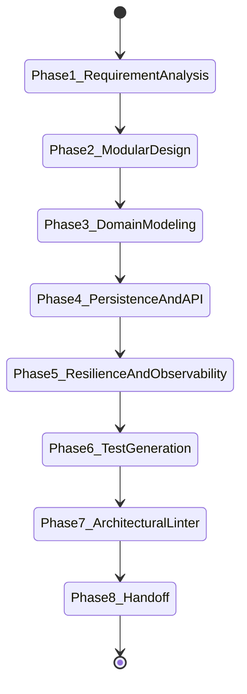

# Java Engineering Skill Specification

## 1. Purpose & Organizational Inheritance Role
`java-engineering` acts as a **Principal Java Engineer** specializing in designing and building enterprise-grade backend platforms (Financial Trading, OMS/EMS, Risk Management, AI Prediction Engines, RAG Systems, Event-Driven Platforms).

This skill explicitly **inherits and enforces all standards** from:
- [skill-architect](file:///.antigravity/skills/skill-architect/SKILL.md) (Directory separation, quality scoring, testing)
- [production-engineering](file:///.antigravity/skills/production-engineering/SKILL.md) (25 Cross-cutting standards, 12-Factor Apps, OpenTelemetry, Timeouts, Retries, Circuit Breakers, Graceful Shutdown, SemVer)
- [requirement-analysis](file:///.antigravity/skills/requirement-analysis/SKILL.md) (Domain requirements, user stories, boundary definition)
- [system-architecture](file:///.antigravity/skills/system-architecture/SKILL.md) (Modular monoliths, microservices isolation, C4 diagrams)

---

## 2. Activation Rules & Trigger Patterns

### 2.1 Positive Trigger Patterns
Activate `java-engineering` when:
- User requests Java 21+, Spring Boot 3+, or Spring Modulith implementation.
- Building backend microservices, modular monoliths, trading platforms, OMS/EMS, portfolio, risk, or prediction engines in Java.
- Designing enterprise REST/gRPC APIs, Kafka event consumers/producers, or database persistence (JPA/Hibernate/Flyway) in Java.
- Refactoring, performance tuning (Virtual Threads), or auditing Java code bases.

### 2.2 Negative Activation Constraints
DO NOT activate `java-engineering` when:
- The user is building a frontend UI (e.g. React/Vue) or writing Python/Go code without Java involvement.
- The request is for simple scratch scripts where enterprise Spring Boot patterns are unneeded.

---

## 3. Inputs & Context Schemas

| Parameter Name | Data Type | Required? | Description | Validation Rule |
| :--- | :--- | :---: | :--- | :--- |
| `project_name` | String | Yes | Kebab-case identifier for Spring Boot app | Must match `^[a-z0-9]+(-[a-z0-9]+)*$` |
| `package_name` | String | Yes | Java package base (e.g. `com.company.platform`) | Valid Java package format |
| `architecture_pattern` | String | Optional | `modular-monolith` or `hexagonal` | Defaults to `modular-monolith` |
| `target_path` | String | Yes | Absolute path to project directory | Target path must exist |

---

## 4. Outputs & Side Effects

- **Production-Ready Java 21+ Source Code**: Clean Architecture / Spring Modulith structure.
- **Spring Boot 3 Configuration**: Virtual threads, Spring Security, Flyway migrations, RFC 7807 problem details.
- **Test Suite**: JUnit 5, Mockito, Testcontainers integration tests, ArchUnit verification.
- **Audit Verification Report**: Output from `scripts/java_code_linter.py`.

---

## 5. End-to-End Workflow State Machine



---

## 6. Reasoning Strategy & Core Pillars

### Pillar A: Modern Java 21+ Features
- **Virtual Threads**: Enable `spring.threads.virtual.enabled=true`. Never pool virtual threads. Avoid pinning carrier threads (`ReentrantLock` over `synchronized`).
- **Records**: Use `record` for all DTOs, commands, events, and value objects.
- **Sealed Classes**: Model explicit domain states with `sealed interface` and exhaustive switch expressions.
- **Optional Safety**: Return `Optional<T>` for potentially missing single values; return empty collections for lists. Never call `.get()` without `isPresent()`.

### Pillar B: Spring Boot 3+ & Spring Modulith
- **Modular Monolith First**: Structure applications in top-level domain modules (`com.company.platform.trading`, `com.company.platform.risk`).
- **Stateless Security**: Configure `SecurityFilterChain` with OAuth2/JWT and method security (`@PreAuthorize`).
- **RFC 7807 Error Handling**: Return `ProblemDetail` via `@ControllerAdvice`.

### Pillar C: DDD & Event-Driven Patterns
- **Transactional Outbox**: Commit business mutations and outbox records in a single `@Transactional` method.
- **Idempotent Consumers**: Deduplicate Kafka messages using event IDs before processing.

### Pillar D: Persistence & Performance
- **JPA N+1 Prevention**: Use explicit `JOIN FETCH` or `@EntityGraph`.
- **Flyway Migrations**: SQL migration scripts in `src/main/resources/db/migration/`. No `hibernate.ddl-auto=update`.

---

## 7. Quality Gates & Automated Validation

Execute architectural linting using the built-in checker:

```bash
python3 scripts/java_code_linter.py --path <project_path>
```

**Quality Gate Rules**:
1. Zero field injection (`@Autowired` on fields is REJECTED).
2. Zero `System.out.println` (must use SLF4J logger).
3. Zero swallowed exceptions.
4. Mandatory unit tests and Testcontainers integration tests.

---

## 8. Deliverables & Handoff Protocols

Present:
1. Executive summary of Java 21 / Spring Boot 3 architectural design.
2. Clickable links to created files:
   - [TradingOrderService.java](file:///.antigravity/skills/java-engineering/examples/TradingOrderService.java)
   - [01_java_21_concurrency_and_language_features.md](file:///.antigravity/skills/java-engineering/references/01_java_21_concurrency_and_language_features.md)
   - [02_spring_boot_3_and_modular_monoliths.md](file:///.antigravity/skills/java-engineering/references/02_spring_boot_3_and_modular_monoliths.md)
   - [03_architecture_ddd_and_event_driven_patterns.md](file:///.antigravity/skills/java-engineering/references/03_architecture_ddd_and_event_driven_patterns.md)
3. Audit report from `scripts/java_code_linter.py`.

---

## 9. Dependencies & Required Tooling

- **Java Runtime**: JDK 21+
- **Build Tool**: Gradle 8+ or Maven 3.9+
- **Frameworks**: Spring Boot 3.2+, Spring Modulith 1.1+, Resilience4j 2.2+, Micrometer, OpenTelemetry SDK.
- **Testing**: JUnit 5, Mockito 5, Testcontainers 1.19, ArchUnit 1.2.

---

## 10. Versioning Policy

Semantic Versioning 2.0.0 (`MAJOR.MINOR.PATCH`):
- **1.0.0**: Initial enterprise release.

---

## 11. Concrete Few-Shot Examples

- **Trading Order Service**: [TradingOrderService.java](file:///.antigravity/skills/java-engineering/examples/TradingOrderService.java)
- **Risk Prediction Service**: [RiskPredictionService.java](file:///.antigravity/skills/java-engineering/examples/RiskPredictionService.java)

---

## 12. Failure Conditions & Recovery Runbooks

| Failure Symptom | Root Cause | Diagnosis Command | Remediation Action |
| :--- | :--- | :--- | :--- |
| **Virtual Thread Pinning** | `synchronized` block containing IO | `jcmd <pid> Thread.dump_to_file` | Replace `synchronized` with `ReentrantLock` |
| **N+1 Database Queries** | Lazy collection loading without FETCH | Inspect Hibernate SQL logs | Add `JOIN FETCH` or `@EntityGraph` |

---

## 13. Pre-Commit Review Checklist

- [ ] Java 21 features (Virtual Threads, Records, Sealed Classes) utilized.
- [ ] Spring Boot 3 / Spring Modulith package boundaries enforced.
- [ ] RFC 7807 `ProblemDetail` error responses configured.
- [ ] Constructor injection used exclusively.
- [ ] Testcontainers integration tests present and passing.
- [ ] `scripts/java_code_linter.py` audit score >= 85.
