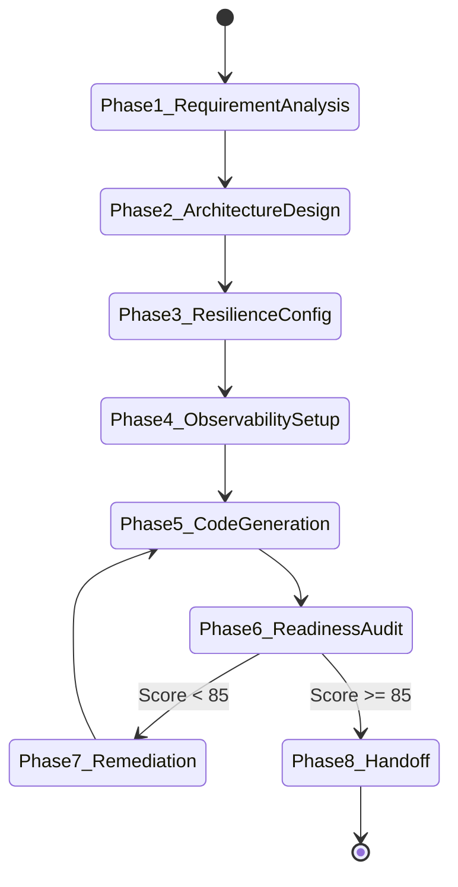

# Production Engineering Root Philosophy & Skill Specification

## 1. Purpose & Organizational Inheritance Role
`production-engineering` is the foundational root engineering skill of our organization. It defines the core software engineering philosophy, architectural standards, resilience patterns, observability requirements, and quality gates expected across all software produced by AI agents or human engineers.

This root skill is explicitly **inherited by every language-specific engineering skill** (e.g., `rust-engineering`, `go-engineering`, `java-engineering`, `typescript-engineering`, `python-engineering`). It guarantees that regardless of the target technology stack, every service, library, or application adheres strictly to uniform enterprise standards.

---

## 2. Activation Rules & Trigger Patterns

### 2.1 Positive Trigger Patterns
Activate `production-engineering` when:
- Designing new services, system architectures, or microservices.
- Establishing organization-wide engineering guidelines, quality gates, or code review standards.
- Auditing codebases or architecture blueprints for production readiness.
- Standardizing cross-cutting concerns: Timeouts, Retries, Circuit Breakers, Observability, Health Checks, DI, Secrets, or API Evolution.
- Invoked directly or implicitly when any language-specific engineering skill (`rust-engineering`, `go-engineering`, etc.) is activated.

### 2.2 Negative Activation Constraints
DO NOT activate `production-engineering` when:
- Writing quick throwaway scratch scripts explicitly declared as temporary experiments by the user.
- Simple, isolated code snippets where architecture decisions are irrelevant.

---

## 3. Inputs & Context Schemas

| Parameter Name | Data Type | Required? | Description | Validation Rule |
| :--- | :--- | :---: | :--- | :--- |
| `service_name` | String | Yes | Kebab-case identifier for target service | Must match `^[a-z0-9]+(-[a-z0-9]+)*$` |
| `target_path` | String | Yes | Absolute path to target workspace | Path must exist on filesystem |
| `architecture_spec` | String | Optional | Path to YAML/JSON blueprint | Must match `templates/01_production_service_blueprint.yaml.template` |
| `target_language` | String | Optional | Language stack (rust, go, java, ts, python) | Must map to an inherited language skill |

---

## 4. Outputs & Artifact Specifications

- **Production Service Blueprint**: Standardized `yaml` or `json` blueprint in project root.
- **Production Readiness Audit Report**: Markdown evaluation report with score (0-100).
- **Codebase Scaffolding**: Code adhering to Clean Architecture, SOLID, and 12-Factor principles.
- **Verification Logs**: Clean output from `scripts/production_readiness_checker.py`.

---

## 5. End-to-End Workflow State Machine



### Workflow Steps:
1. **Phase 1: Requirement Analysis**: Define bounded contexts, domain aggregates, and SLOs.
2. **Phase 2: Architecture Design**: Establish Clean Architecture layers (Domain -> Use Case -> Infrastructure).
3. **Phase 3: Resilience Configuration**: Configure explicit timeouts, retries with full jitter, circuit breakers, and graceful shutdown.
4. **Phase 4: Observability Setup**: Define OpenTelemetry log, trace context, RED metrics, and health probes.
5. **Phase 5: Code Generation**: Produce code via language-specific skill inheriting this root skill.
6. **Phase 6: Readiness Audit**: Run `scripts/production_readiness_checker.py`.
7. **Phase 7: Remediation**: Fix missing resilience, security, or observability rules if score < 85.
8. **Phase 8: Handoff**: Deliver verified code and production readiness report.

---

## 6. Reasoning Strategy & 25 Core Standards

AI agents executing software engineering tasks MUST enforce the following 25 production standards across 5 major domains:

### Domain A: Architectural Foundations & Maintainability
- **[Scalability](references/04_scalability_performance_and_security.md)**: Stateless process nodes, database read/write separation, caching with TTL.
- **[Maintainability](references/01_architectural_foundations.md)**: Clean Architecture isolation, DRY, small modular packages.
- **[Clean Architecture](references/01_architectural_foundations.md)**: Inward dependency rule; Domain layer free of framework imports.
- **[SOLID Principles](references/01_architectural_foundations.md)**: Single Responsibility, Open/Closed, Liskov, Interface Segregation, Dependency Inversion.
- **[Domain-Driven Design (DDD)](references/01_architectural_foundations.md)**: Ubiquitous language, bounded contexts, aggregate root transactions.
- **[Event-Driven Architecture (EDA)](references/01_architectural_foundations.md)**: Transactional Outbox pattern, idempotent consumers, DLQ.
- **[Twelve-Factor Apps](references/01_architectural_foundations.md)**: Strict 12-factor cloud-native process execution.

### Domain B: Reliability & Fault Tolerance
- **[Reliability](references/02_resilience_and_fault_tolerance.md)**: Static stability, static fallbacks, zero single points of failure.
- **[Performance](references/04_scalability_performance_and_security.md)**: Non-blocking async IO, P95 < 100ms, explicit resource bounds.
- **[Timeouts](references/02_resilience_and_fault_tolerance.md)**: Mandatory explicit timeouts on all IO; deadline propagation.
- **[Retry Policies](references/02_resilience_and_fault_tolerance.md)**: Exponential backoff with full jitter for transient errors (max 3 retries).
- **[Circuit Breakers](references/02_resilience_and_fault_tolerance.md)**: Protect fragile dependencies; sliding window failure thresholds.
- **[Cancellation & Graceful Shutdown](references/02_resilience_and_fault_tolerance.md)**: Trap SIGTERM, update readiness to 503, drain traffic, flush OTel.
- **[Health Checks](references/02_resilience_and_fault_tolerance.md)**: Distinct Startup, Liveness, and Readiness K8s probes.

### Domain C: Observability & Operations
- **[Observability](references/03_observability_and_telemetry.md)**: Unified logs, metrics, and traces correlated by trace_id.
- **[Logging](references/03_observability_and_telemetry.md)**: Single-line structured JSON to stdout/stderr; zero PII.
- **[Metrics](references/03_observability_and_telemetry.md)**: RED method for APIs; USE method for infrastructure; Prometheus endpoint.
- **[Tracing](references/03_observability_and_telemetry.md)**: OpenTelemetry SDK with W3C `traceparent` context header propagation.
- **[Dependency Injection](references/04_scalability_performance_and_security.md)**: Constructor injection; depend on interfaces; central composition root.
- **[Configuration](references/04_scalability_performance_and_security.md)**: Environment variable injection into strongly-typed validated structs at boot.

### Domain D: Security & Secrets
- **[Security](references/04_scalability_performance_and_security.md)**: TLS 1.3 / mTLS everywhere, least privilege DB access, input sanitization.
- **[Secrets Management](references/04_scalability_performance_and_security.md)**: Zero hardcoded secrets; dynamic vault/K8s secret injection.

### Domain E: Testing, SDLC & API Evolution
- **[Testing](references/05_sdlc_api_evolution_and_testing.md)**: Testing pyramid (Unit 70%, Integration 20%, Contract/E2E 10%).
- **[Code Reviews](references/05_sdlc_api_evolution_and_testing.md)**: Google practices; atomic PRs < 400 lines diff; clear context.
- **[Documentation](references/05_sdlc_api_evolution_and_testing.md)**: README, ARCHITECTURE, ADRs in `docs/adr/`, RUNBOOK.
- **[Versioning, Backward Compatibility & API Evolution](references/05_sdlc_api_evolution_and_testing.md)**: SemVer 2.0.0, Stripe idempotency keys, additive schema mutations only.

---

## 7. Quality Gates & Automated Validation

Audit software against production standards using the built-in checker:

```bash
python3 scripts/production_readiness_checker.py --spec templates/01_production_service_blueprint.yaml.template
```

**Pass Condition**: Readiness Score **>= 85** (APPROVED).

---

## 8. Deliverables & Handoff Protocols

When handoff occurs, present:
1. Executive summary of architectural choices.
2. Clickable links to created files and blueprint:
   - [production_service_blueprint.yaml](file:///.antigravity/skills/production-engineering/templates/01_production_service_blueprint.yaml.template)
   - [01_architectural_foundations.md](file:///.antigravity/skills/production-engineering/references/01_architectural_foundations.md)
   - [02_resilience_and_fault_tolerance.md](file:///.antigravity/skills/production-engineering/references/02_resilience_and_fault_tolerance.md)
   - [03_observability_and_telemetry.md](file:///.antigravity/skills/production-engineering/references/03_observability_and_telemetry.md)
   - [04_scalability_performance_and_security.md](file:///.antigravity/skills/production-engineering/references/04_scalability_performance_and_security.md)
   - [05_sdlc_api_evolution_and_testing.md](file:///.antigravity/skills/production-engineering/references/05_sdlc_api_evolution_and_testing.md)
3. Audit output from `scripts/production_readiness_checker.py`.

---

## 9. Dependencies & Required Tooling

- **Python 3.10+**: `pyyaml`, `pytest`.
- **Validation Scripts**:
  - [production_readiness_checker.py](scripts/production_readiness_checker.py)
  - [api_compatibility_checker.py](scripts/api_compatibility_checker.py)

---

## 10. Versioning & SemVer Policy

This skill follows Semantic Versioning 2.0.0:
- **MAJOR (1.0.0)**: Breaking changes to fundamental architectural requirements.
- **MINOR (1.1.0)**: Adding new quality standards or verification scripts.
- **PATCH (1.0.1)**: Documentation improvements and bug fixes.

---

## 11. Concrete Few-Shot Examples

- **Golden Payment Service Spec**: [01_production_payment_service_spec.json](file:///.antigravity/skills/production-engineering/examples/01_production_payment_service_spec.json)
- **Sample Audit Report**: [02_production_readiness_report_sample.md](file:///.antigravity/skills/production-engineering/examples/02_production_readiness_report_sample.md)

---

## 12. Failure Conditions & Recovery Runbooks

| Failure Mode | Root Cause | Diagnosis Command | Remediation Action |
| :--- | :--- | :--- | :--- |
| **Audit Score < 85** | Missing timeouts, OTel, or health probes | `python3 scripts/production_readiness_checker.py --spec <file>` | Inspect failed checks and add missing configuration blocks |
| **Breaking API Change** | Removed field or type mutation | `python3 scripts/api_compatibility_checker.py --old <old> --new <new>` | Revert breaking field change; use additive optional fields |

---

## 13. Pre-Commit Review Checklist

- [ ] All 25 engineering standards referenced.
- [ ] References in `references/` fully populated.
- [ ] Templates in `templates/` valid and linted.
- [ ] Scripts in `scripts/` executable and unit tested.
- [ ] Test suite in `tests/` passing with zero errors.
- [ ] `metadata/skill.json` valid JSON.
- [ ] Documentation in `docs/` complete.

---

## 14. Synthesized Engineering Philosophy Matrix

| Source / Benchmark | Key Philosophy Adopted in Skill |
| :--- | :--- |
| **Google Engineering Practices** | Code readability, small atomic PRs (<400 lines), strict code reviews, testing culture. |
| **Uber Engineering** | DOMA microservice isolation, rate limiting, traffic shadowing, bulkhead fault isolation. |
| **Netflix Engineering** | Chaos engineering, circuit breaker pattern, client-side load balancing, degraded fallbacks. |
| **Stripe Engineering** | Date-based API versioning, idempotency key design, developer ergonomics, backward compatibility. |
| **Cloudflare Engineering** | High throughput, edge performance, zero trust security, graceful degradation under load. |
| **AWS Builders Library** | Timeouts, retries with exponential backoff & full jitter, static stability, shuffle sharding. |
| **Amazon Leadership Practices**| Operational excellence, deep dive, single-threaded ownership, safety rails. |
| **Microsoft Engineering** | Security Development Lifecycle (SDL), enterprise integration patterns, API design rules. |
| **Rust API Guidelines** | Explicit types, memory/concurrency safety, zero-cost abstractions. |
| **Effective Java** | Immutability, builder pattern, interface segregation, explicit exception hierarchy. |
| **Effective Go** | Contextual cancellation, explicit error handling, channel patterns, non-blocking IO. |
| **Clean Architecture** | Inward dependency rule, framework independence, ports & adapters (hexagonal). |
| **SOLID** | Single Responsibility, Open/Closed, Liskov Substitution, Interface Segregation, Dependency Inversion. |
| **DDD** | Ubiquitous language, bounded contexts, aggregate roots, value objects, domain events. |
| **Event-Driven Architecture** | Transactional outbox pattern, idempotent consumers, CloudEvents, Dead Letter Queues (DLQ). |
| **Twelve-Factor Apps** | Declarative automation, port binding, stateless processes, environment config, disposability. |
| **OpenTelemetry** | Unified structured JSON logging, RED/USE metrics, W3C traceparent distributed tracing. |
| **CNCF Best Practices** | Immutable infrastructure, containerized microservices, declarative state management. |
| **Kubernetes Application Design**| Startup, Liveness, Readiness probes, SIGTERM handling, PodDisruptionBudgets, resource limits. |

---

## 15. Cross-Language Inheritance Model

Language-specific skills inherit this root skill and specialize its patterns into native idiomatic syntax:

```
                      +--------------------------+
                      |  production-engineering  |
                      |    (Root Philosophy)     |
                      +--------------------------+
                                   |
         +-----------------+-------+-------+-----------------+
         |                 |               |                 |
         v                 v               v                 v
+-----------------+ +--------------+ +---------------+ +--------------------+
| rust-engineering| |go-engineering| |java-engineering| |typescript-engineering|
+-----------------+ +--------------+ +---------------+ +--------------------+
```

Detailed guide on language skill implementation: [INHERITANCE_GUIDE.md](file:///.antigravity/skills/production-engineering/docs/INHERITANCE_GUIDE.md).

---

## 16. Operational Excellence & Postmortem Guidelines

- **Blameless Postmortems**: Focus on systemic fixes, automation, and root cause analysis (5 Whys).
- **Chaos Testing**: Periodically inject network latency and container kills to validate static stability.
- **Production Readiness Reviews (PRRs)**: Required before launching any new service tier.
