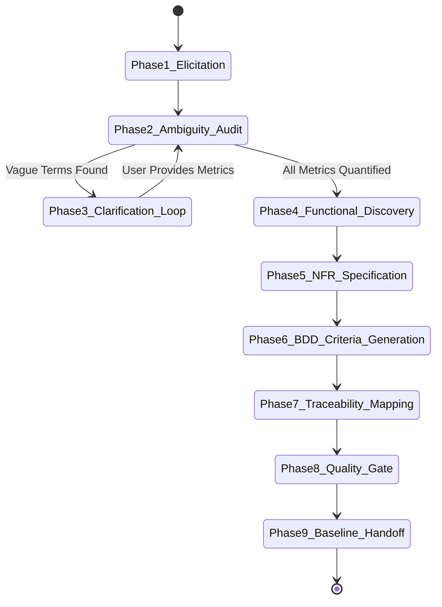

# Requirement Analysis Skill Instruction Set & State Machine

## 1. Executive Purpose & Organizational Role
`requirement-analysis` is the **FIRST step** of our organization's AI-assisted Software Development Lifecycle (SDLC). It bridges business ideas from quantitative researchers, portfolio managers, risk officers, and traders into implementation-ready engineering requirements.

This skill is specifically designed for our institutional AI-first quantitative trading platform, encompassing:
- Quantitative Research & Alpha Discovery
- Strategy Development & Event-Driven Backtesting
- Paper Trading & High-Frequency Live Execution
- Market Prediction & Autonomous AI Agents
- Portfolio Management & Real-Time Pre-Trade Risk Controls
- Market Data Infrastructure (L1/L2/L3 order books, ITCH/OUCH, FIX, SBE)
- Order Management System (OMS) & Execution Management System (EMS)

The outputs of this skill serve as direct inputs for the downstream **PRD Design** skill.

---

## 2. Activation Rules & Trigger Patterns

### 2.1 Positive Trigger Patterns
Activate `requirement-analysis` when:
- User submits a new feature idea, trading strategy concept, risk control request, or platform enhancement.
- User requests to write, analyze, clarify, or refine software requirements for trading components.
- Prompt contains: *"analyze requirements for..."*, *"refine trading idea"*, *"convert user story to requirements"*, *"create SRS for..."*, *"generate Gherkin acceptance criteria"*.

### 2.2 Negative Activation Constraints
DO NOT activate `requirement-analysis` when:
- The user is asking to generate low-level C++/Rust code or database migration scripts (that belongs in downstream coding phases).
- The user is creating a PRD document (that belongs to `prd-design`).
- The task is a general non-trading question.

### 2.3 Ambiguity Rejection Protocol (STRICT RULE)
If the user's input contains vague, unquantified terms:
- **TERMS TO REJECT**: *"fast"*, *"real-time"*, *"scalable"*, *"high availability"*, *"user-friendly"*, *"robust"*, *"low latency"*, *"secure"*, *"seamless"*.
- **ACTION**: The skill MUST **REJECT** the requirement draft immediately and execute an **Interactive Clarifying Questionnaire Loop**. It will ask the user for explicit numerical metric bounds (e.g. `< 50 microseconds at p99`, `> 100,000 msg/sec`, `99.999% uptime`, `RTO < 2s`).

---

## 3. Inputs & Context Schemas

| Parameter Name | Data Type | Required? | Description | Validation Rule |
| :--- | :--- | :---: | :--- | :--- |
| `business_idea` | String | Yes | Feature concept or trading request | Minimum 10 characters |
| `domain_module` | String | Yes | Target quantitative trading domain | Must be one of: `RESEARCH`, `STRATEGY`, `BACKTEST`, `LIVE_TRADING`, `RISK`, `PORTFOLIO`, `MDI`, `OMS_EMS`, `PREDICTION` |
| `stakeholder_role` | String | Optional | Target primary user persona | e.g. `Quant Researcher`, `Risk Manager`, `Execution Trader` |
| `target_path` | String | Optional | Output file path for generated SRS | Defaults to `docs/requirements/` |

---

## 4. Outputs & Side Effects

| Output Item | Path / Format | Description |
| :--- | :--- | :--- |
| **System Requirements Document (SRS)** | `docs/requirements/<module>_srs.md` | Complete requirements specification using [requirements_catalog_template.md](templates/requirements_catalog_template.md) |
| **BDD Gherkin Test Suite** | Embedded in SRS | Executable `Given-When-Then` test scenarios for all Functional Requirements |
| **Requirement Traceability Matrix** | Embedded in SRS | End-to-end mapping table (`BG -> FR -> NFR -> BDD`) |
| **Ambiguity Audit Report** | Brain Artifact Directory | Output from `scripts/ambiguity_checker.py` |

---

## 5. End-to-End Workflow State Machine

### Phase Breakdown:
1. **Phase 1: Elicitation & Domain Mapping**: Map input to quantitative trading modules ([references/01_quant_trading_domain_knowledge.md](references/01_quant_trading_domain_knowledge.md)).
2. **Phase 2: Ambiguity Audit**: Run `scripts/ambiguity_checker.py` to detect unquantified terms.
3. **Phase 3: Clarification Loop**: Ask targeted questions until every latency, throughput, and availability target is numerical ([references/02_requirement_engineering_standards.md](references/02_requirement_engineering_standards.md)).
4. **Phase 4: Functional Discovery**: Extract Business Goals (`BG-XXX`), Functional Requirements (`FR-XXX`), and Business Rules (`BR-XXX`).
5. **Phase 5: Non-Functional Specification**: Formulate explicit NFR metrics (`NFR-LAT`, `NFR-THR`, `NFR-AVL`, `NFR-SEC`) ([references/03_engineering_architecture_and_nfr.md](references/03_engineering_architecture_and_nfr.md)).
6. **Phase 6: BDD Acceptance Criteria Generation**: Write Gherkin `Given-When-Then` scenarios for happy path and failure edge cases.
7. **Phase 7: Traceability Mapping**: Build complete Requirement Traceability Matrix (`BG -> FR -> NFR -> BDD`).
8. **Phase 8: Quality Gate Verification**: Verify against checklist ([references/04_requirement_checklists_and_matrices.md](references/04_requirement_checklists_and_matrices.md)) and run `scripts/traceability_validator.py`.
9. **Phase 9: Baseline & Handoff**: Lock requirement baseline and hand off to `prd-design`.

---

## 6. Reasoning Strategy & Cognitive Guidelines

1. **Quant Trading Realism**:
   - Always consider order book dynamics (L1/L2/L3), latency spikes, exchange circuit breakers, and SEC 15c3-5 risk controls.
2. **Zero Ambiguity Tolerance**:
   - Reject statements like *"System should process market data fast"* -> Demand: *"System MUST ingest L3 market data at > 500,000 msg/sec per node with < 50us p99 latency."*
3. **Defensive Failure Mode Discovery**:
   - For every requirement, analyze edge cases: exchange disconnects, stale ticks, buffer overflows, and memory bounds.

---

## 7. Quality Gates & Automated Validation

Every requirement specification must pass:
1. **Ambiguity Auditor**: `python3 scripts/ambiguity_checker.py --file <srs_path>` (Must return `passed=True`).
2. **Traceability Validator**: `python3 scripts/traceability_validator.py --file <srs_path>` (Must return `valid=True`).
3. **Quality Score Target**: Minimum **85 / 100**.

---

## 8. Deliverables & Downstream Handoff

Upon completing requirement analysis:
1. Output structured SRS artifact formatted with GitHub-style markdown.
2. Provide clickable file links (`file:///...`).
3. Include explicit note: *"This requirement specification is BASELINED and ready for PRD Design."*

---

## 9. Dependencies & Required Tooling
- **Scripts**:
  - [ambiguity_checker.py](scripts/ambiguity_checker.py)
  - [traceability_validator.py](scripts/traceability_validator.py)
- **References**:
  - [01_quant_trading_domain_knowledge.md](references/01_quant_trading_domain_knowledge.md)
  - [02_requirement_engineering_standards.md](references/02_requirement_engineering_standards.md)
  - [03_engineering_architecture_and_nfr.md](references/03_engineering_architecture_and_nfr.md)
  - [04_requirement_checklists_and_matrices.md](references/04_requirement_checklists_and_matrices.md)

---

## 10. Versioning & SemVer Strategy
- **Version**: `1.0.0`
- Governed by standard organizational SemVer 2.0.0 rules.

---

## 11. Concrete Few-Shot Examples
- **Golden Example Specification**: [examples/05_risk_engine_requirements.md](examples/05_risk_engine_requirements.md)

---

## 12. Failure Conditions & Recovery Runbooks

| Symptom | Cause | Recovery Action |
| :--- | :--- | :--- |
| **Ambiguity Audit Failure** | Vague adjective used | Prompt user to specify exact quantitative threshold (ms, us, msg/s) |
| **Traceability Gap** | Functional Req missing BDD test | Generate missing Gherkin `Scenario:` using template |

---

## 13. Pre-Commit Review Checklist
- [ ] Zero vague terms detected by `ambiguity_checker.py`
- [ ] All Functional Requirements have Gherkin scenarios
- [ ] Traceability matrix maps BG -> FR -> NFR -> BDD
- [ ] Pre-trade risk and compliance controls identified
- [ ] Quality score evaluated by `quality_scorer.py` >= 85
