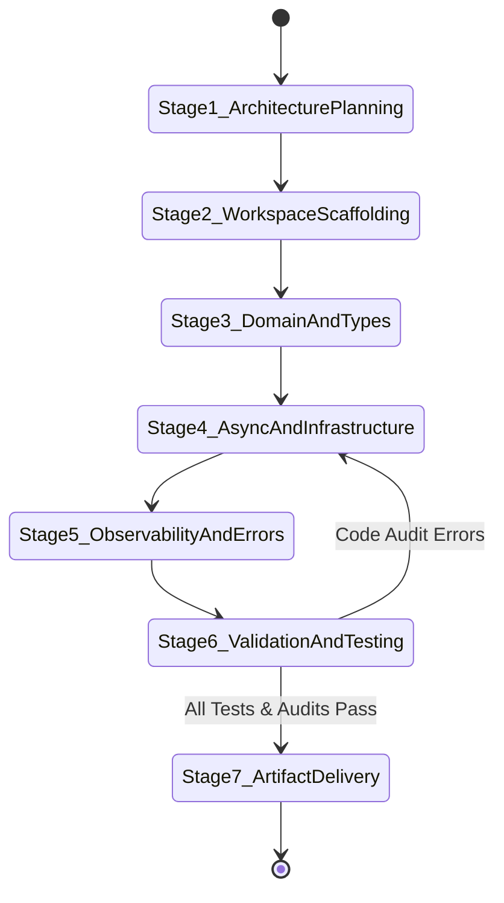

# Rust Engineering Skill Specification

## 1. Purpose & Organizational Role
`rust-engineering` is the specialized production engineering skill for building ultra-fast, memory-safe, reliable backend services, microservices, asynchronous event processors, and high-throughput networking systems using Rust.

It inherits every production standard defined by our Production Engineering organization, enforcing:
- **Zero-Cost Abstractions**: Leveraging Rust's ownership model, compile-time trait monomorphization, and RAII without runtime overhead.
- **Async Concurrency & Cancellation Safety**: Built around the Tokio asynchronous ecosystem (`tokio`, `axum`, `tower`, `hyper`).
- **Strict Error Handling**: Categorized domain error hierarchies (`thiserror`) for libraries/core domain and context wrappers (`anyhow`) for application entrypoints.
- **Comprehensive Observability**: Structured JSON logging, OpenTelemetry trace context propagation, and Prometheus metrics.
- **Uncompromised Memory Safety**: Defaulting to `#![deny(unsafe_code)]` with mandatory safety invariant documentation for any unavoidable low-level operations.

---

## 2. Activation Rules & Trigger Patterns

### 2.1 Positive Trigger Patterns
Activate `rust-engineering` when:
- The user requests to build, design, refactor, or optimize Rust backend services, web servers, microservices, or CLI tools.
- The user requests async Tokio runtime code, channel selection, or cancellation-safe loops.
- The user requests Axum web routes, Tower middleware composition, or HTTP state management.
- The user requests database integration using SQLx / SeaORM, Redis caching, or Kafka streaming in Rust.
- The user requests error handling design (`thiserror`, `anyhow`, `IntoResponse`).
- Prompt keywords include: *"build Rust service"*, *"write Axum server"*, *"Tokio async loop"*, *"SQLx database query"*, *"lock-free concurrency in Rust"*, *"rust error handling"*, *"Criterion benchmark"*.

### 2.2 Negative Activation Constraints
DO NOT activate `rust-engineering` when:
- The user is asking general non-Rust programming questions.
- The user is building frontend web applications without Rust/Wasm scope.

### 2.3 Context & Disambiguation Rules
If the user request is ambiguous (e.g., *"How do I handle requests concurrently?"*):
1. Clarify if they are targetting a **Rust / Tokio async backend** service.
2. If confirmed, activate `rust-engineering` and initiate the 7-stage engineering lifecycle.

---

## 3. Inputs & Context Schemas

| Parameter Name | Data Type | Required? | Description | Validation Rule |
| :--- | :--- | :---: | :--- | :--- |
| `target_scope` | String | Yes | Target engineering scope (`FULL_SERVICE`, `MODULE`, `CRATE`, `ASYNC_LOOP`, `BENCHMARK`) | Must match valid enum values |
| `architecture_type` | String | Optional | Architectural layout (`Cargo Workspace`, `Modular Crate`) | Defaults to `Cargo Workspace` |
| `database_type` | String | Optional | Database engine (`PostgreSQL (SQLx)`, `SeaORM`, `Redis`, `None`) | Defaults to `PostgreSQL (SQLx)` |
| `output_path` | String | Optional | Destination directory for Rust source files | Defaults to workspace crates directory |

---

## 4. Outputs & Artifact Specifications

| Output Artifact | Path / Location | Description |
| :--- | :--- | :--- |
| **Cargo Workspace Manifest** | `Cargo.toml` | Workspace configuration with inherited dependencies and release profiles |
| **Production Source Files** | `src/*.rs` or `crates/*` | Modular Rust source files (Domain, Router, Repository, State, Error) |
| **Domain Error Hierarchy** | `crates/domain/src/error.rs` | Type-safe error enums using `thiserror` with Axum `IntoResponse` |
| **Async Tokio Web Server** | `crates/api/src/main.rs` | Production Axum server with graceful shutdown signal handling |
| **Validation Report** | Brain Artifact | Automated code quality audit via `scripts/rust_code_validator.py` |

---

## 5. End-to-End Workflow State Machine

### Stage Execution Details:
1. **Stage 1: Architecture & Cargo Planning**: Define workspace layout, dependency inheritance, and performance goals.
2. **Stage 2: Workspace Scaffolding**: Generate root `Cargo.toml` and crate layouts using [templates/cargo_workspace_template.md](templates/cargo_workspace_template.md).
3. **Stage 3: Domain & Type System Engineering**: Define domain entities, traits, value objects, and zero-cost error enums using [templates/domain_error_template.rs](templates/domain_error_template.rs).
4. **Stage 4: Async Infrastructure & Web Layer**: Implement Tokio runtime tasks, channels (`mpsc`/`oneshot`), Axum routing, Tower middleware, and SQLx repositories using [templates/axum_server_template.rs](templates/axum_server_template.rs) and [templates/repository_template.rs](templates/repository_template.rs).
5. **Stage 5: Observability & Graceful Shutdown**: Wire up structured JSON logging (`tracing`), OpenTelemetry trace context, Prometheus metrics, and `SIGINT`/`SIGTERM` cancellation tokens.
6. **Stage 6: Code Quality Audit & Testing**: Run `scripts/rust_code_validator.py` and `cargo test` to verify zero unwrap calls, safety comments, and clean trait bounds.
7. **Stage 7: Handoff & Artifact Delivery**: Present complete, production-ready Rust code artifacts and clickable links to the user.

---

## 6. Decision Process & Reasoning Strategy

When generating or refactoring Rust code, strictly follow these engineering principles:

1. **Async Runtime Rules (Tokio)**:
   - Never run blocking I/O or heavy CPU computations on async worker threads; offload to `tokio::task::spawn_blocking`.
   - Choose channels intentionally: `mpsc` for work queues, `oneshot` for RPC responses, `broadcast` for pub/sub, `watch` for state updates.
   - Guarantee Cancellation Safety in `tokio::select!` loops using `CancellationToken`.

2. **Error Handling Principles**:
   - Use `thiserror` for strongly-typed domain/library errors.
   - Use `anyhow` for application entrypoint error propagation (`main.rs`).
   - Implement `axum::response::IntoResponse` for custom domain error enums to return structured JSON error payloads with accurate HTTP status codes.

3. **Memory Safety & Unsafe Rules**:
   - Enforce `#![deny(unsafe_code)]` at the workspace level.
   - If low-level `unsafe` operations are unavoidable, isolate them inside a safe abstraction and include a mandatory `// SAFETY:` comment documenting preconditions.

4. **Performance & Allocations**:
   - Prefer borrowing (`&str`, `&[u8]`) or reference-counted zero-copy buffers (`bytes::Bytes`, `Arc<T>`) over cloning large data structures.
   - Use `parking_lot::Mutex` for synchronous critical sections; only use `tokio::sync::Mutex` if locks are held across `.await` points.
   - Configure global allocator `mimalloc` in release binaries for high-concurrency memory allocation efficiency.

---

## 7. Quality Gates & Automated Validation

Every generated Rust codebase MUST pass automated validation via `scripts/rust_code_validator.py`.

### Quality Gate Checkpoints:
- [ ] **Compilation Clean**: `cargo check` and `cargo test` execute with zero compilation errors.
- [ ] **Zero Unhandled Panics**: Code avoids bare `.unwrap()` calls in production code paths; uses `?` or explicit `.expect("rationale")`.
- [ ] **Unsafe Safety Comments**: Any `unsafe` block includes a mandatory `// SAFETY:` rationale comment.
- [ ] **Structured Observability**: Tracing spans and logs (`tracing::info!`, `tracing::error!`) are embedded across key execution paths.
- [ ] **Graceful Shutdown**: Async servers handle termination signals (`SIGINT`/`SIGTERM`) and drain connections cleanly.
- [ ] **Automated Script Audit**: `python3 scripts/rust_code_validator.py --file-path <path>` executes with PASSED status.

---

## 8. Failure Conditions & Recovery Runbooks

| Failure Symptom | Root Cause | Diagnosis Command | Remediation Action |
| :--- | :--- | :--- | :--- |
| **Worker Starvation** | CPU-heavy operation running on Tokio worker thread | Inspect stack traces or Tokio console metrics | Wrap CPU-intensive logic in `tokio::task::spawn_blocking` |
| **State Loss in `select!`** | Non-cancellation-safe future dropped inside `tokio::select!` branch | Check `tokio::select!` branches for partial reads | Move state accumulation outside `select!` or use cancellation-safe primitives |
| **Unsafe Validation Fail** | `unsafe` block missing mandatory `// SAFETY:` comment | `python3 scripts/rust_code_validator.py --file-path <path>` | Add explicit safety comment detailing alignment, pointer validity, and aliasing invariants |

---

## 9. References & Deep Dive Knowledge Base

Refer to the specialized reference guides in `references/` for detailed architectural patterns:
- [01_rust_architecture_and_workspaces.md](references/01_rust_architecture_and_workspaces.md): Cargo Workspaces, Visibility, Traits, Generics, RAII, Lifetimes.
- [02_async_tokio_and_networking.md](references/02_async_tokio_and_networking.md): Tokio Runtime, Channels, Cancellation Safety, Axum, Tower Middleware, Graceful Shutdown.
- [03_error_handling_and_types.md](references/03_error_handling_and_types.md): `thiserror`, `anyhow`, Domain Errors, Axum `IntoResponse` HTTP mapping.
- [04_concurrency_and_performance.md](references/04_concurrency_and_performance.md): Lock-free data structures, Atomics, Memory Ordering, `parking_lot`, `mimalloc`, Criterion.
- [05_databases_messaging_observability.md](references/05_databases_messaging_observability.md): SQLx PostgreSQL, Redis, Kafka streaming, Tracing, OpenTelemetry, Prometheus.
- [06_unsafe_rust_and_soundness.md](references/06_unsafe_rust_and_soundness.md): Soundness rules, `// SAFETY:` documentation, Miri verification.

---

## 10. Reusable Templates & Worked Examples

### Production Templates:
- [cargo_workspace_template.md](templates/cargo_workspace_template.md): Cargo Workspace Scaffold Template
- [axum_server_template.rs](templates/axum_server_template.rs): Axum Web Server with Graceful Shutdown
- [domain_error_template.rs](templates/domain_error_template.rs): Domain Error Enum & HTTP Mapping (`thiserror`)
- [repository_template.rs](templates/repository_template.rs): SQLx Repository Pattern Template

### Worked Examples:
- [tokio_cancellation_shutdown.rs](examples/tokio_cancellation_shutdown.rs): Cancellation-Safe Tokio Worker & Shutdown
- [lockfree_event_bus.rs](examples/lockfree_event_bus.rs): High-Throughput Lock-Free Atomic Bus
