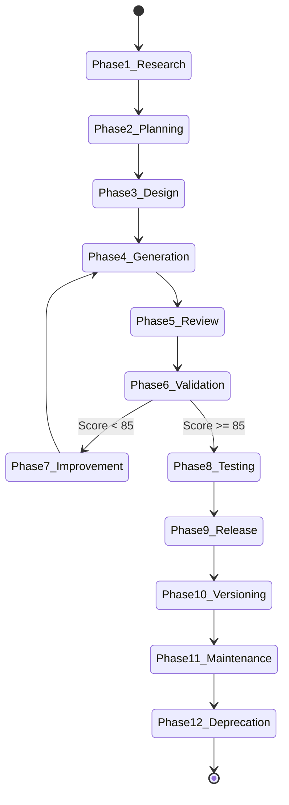

# Skill Architect Specification & Root Framework

## 1. Purpose & Organizational Role
`skill-architect` is the foundational root skill of the organization's AI Skill ecosystem. Every future AI Skill must be generated, standardized, validated, and evaluated using this skill. It replaces ad-hoc prompt engineering with a rigorous, production-grade Software Development Lifecycle (SDLC) framework for AI agent capabilities.

The objective of `skill-architect` is to ensure every AI Skill in the organization is:
- **Modular & Deterministic**: Enforces standard directory separation and explicit input/output contracts.
- **Self-Testing & Verifiable**: Programmatically audited by built-in quality scoring engines (`quality_scorer.py`).
- **Production-Grade**: Built with complete scaffolding templates, edge-case runbooks, and human/machine documentation.
- **Versioned & Maintainable**: Governed by Semantic Versioning 2.0.0 and clear migration policies.

---

## 2. Activation Rules & Trigger Patterns

### 2.1 Positive Trigger Patterns
Activate `skill-architect` when:
- User explicitly requests to create, scaffold, design, build, or architect a new AI Skill.
- User requests to audit, validate, quality-score, refactor, or upgrade an existing AI Skill.
- User invokes slash commands or workflow triggers related to organizational skill standardization.
- Prompt phrases contain: *"create a new skill"*, *"build an AI skill"*, *"design a skill for..."*, *"validate skill structure"*, *"score skill quality"*.

### 2.2 Negative Activation Constraints
DO NOT activate `skill-architect` when:
- The user is asking a general coding question unrelated to skill creation or architecture.
- The task involves executing a domain-specific action that already has a specialized domain skill (e.g. standard database migrations without skill creation).
- The user asks simple direct questions not requiring skill scaffolding or engineering framework generation.

### 2.3 Context & Disambiguation Rules
If the user's intent is ambiguous (e.g., *"Make a helper for REST APIs"*):
1. Ask whether they want to create a **production AI Skill** (`rest-api-designer`) or simply generate code files.
2. If creating a skill, automatically activate `skill-architect` and initiate the 12-phase skill generation lifecycle.

---

## 3. Inputs & Context Schemas

| Parameter Name | Data Type | Required? | Description | Validation Rule |
| :--- | :--- | :---: | :--- | :--- |
| `skill_name` | String | Yes | Kebab-case identifier for the target skill (e.g. `database-migration-architect`) | Must match regex `^[a-z0-9]+(-[a-z0-9]+)*$` |
| `description` | String | Yes | Comprehensive description of skill purpose and domain boundary | Minimum 15 characters |
| `output_dir` | String | Optional | Target filesystem path for skill repository | Defaults to `.antigravity/skills` |
| `domain_specs` | Object | Optional | Technical reference documents, schemas, or API guidelines | JSON object or Markdown string |
| `target_score` | Integer | Optional | Minimum quality score required for quality gate release | Integer between 85 and 100 (Default: 85) |

---

## 4. Outputs & Side Effects

| Output Artifact | Path / Location | Format | Description |
| :--- | :--- | :--- | :--- |
| **Complete Skill Directory** | `.antigravity/skills/<skill_name>/` | Folder Structure | Standardized 9-directory skill repository |
| **Executable Instructions** | `.antigravity/skills/<skill_name>/SKILL.md` | Markdown + YAML | Primary instruction manual and state machine |
| **Quality Report** | Brain Artifact Directory | Markdown / JSON | Detailed 10-dimension evaluation report and letter grade |
| **Metadata Manifest** | `.antigravity/skills/<skill_name>/metadata/skill.json` | JSON | Machine-readable manifest conforming to `skill_manifest_schema.json` |
| **Test Suite** | `.antigravity/skills/<skill_name>/tests/` | Python (`.py`) | Automated unit tests and test fixtures |

---

## 5. End-to-End Workflow State Machine

The Skill Generation Workflow follows a strict 12-phase state machine:



### Phase Details:
1. **Phase 1: Research**: Inspect domain background, existing code patterns, and multi-platform prompt guidelines ([references/01_antigravity_gemini_claude_standards.md](references/01_antigravity_gemini_claude_standards.md)).
2. **Phase 2: Planning**: Define skill boundary, trigger rules, input/output schemas, and quality targets.
3. **Phase 3: Design**: Outline the 9-directory structure, template requirements, and decision trees.
4. **Phase 4: Generation**: Execute `scripts/skill_generator.py` to scaffold all folders, write `SKILL.md`, populate `templates/`, `scripts/`, `tests/`, `docs/`, `metadata/`.
5. **Phase 5: Review**: Perform automated structural audit via `scripts/skill_validator.py`.
6. **Phase 6: Validation**: Execute `scripts/quality_scorer.py` to score the skill out of 100.
7. **Phase 7: Improvement (Loop)**: If score < 85, remediate missing documentation, weak prompts, or unhandled edge cases.
8. **Phase 8: Testing**: Execute unit tests in `tests/test_*.py` using Pytest or native test runner.
9. **Phase 9: Release**: Register manifest in `metadata/skill.json` and tag Git repository.
10. **Phase 10: Versioning**: Enforce Semantic Versioning 2.0.0 rules ([references/03_naming_and_semver_policy.md](references/03_naming_and_semver_policy.md)).
11. **Phase 11: Maintenance**: Monitor quality score stability across model updates and CI/CD runs.
12. **Phase 12: Deprecation**: Execute deprecation protocol for obsolete skill versions ([references/03_naming_and_semver_policy.md](references/03_naming_and_semver_policy.md)).

---

## 6. Decision Process & Reasoning Strategy

When generating or evaluating an AI Skill, follow this cognitive reasoning process:

1. **Defensive Structural Verification**:
   - Never write code directly into `SKILL.md` if it exceeds 50 lines; place it in `scripts/` or `templates/`.
   - Never pollute `references/` with executable scripts or binary files ([references/02_directory_standards_and_restrictions.md](references/02_directory_standards_and_restrictions.md)).
2. **Lazy-Loading Strategy**:
   - Keep `SKILL.md` under 500 lines by delegating deep domain specifications to markdown links in `references/`.
3. **Explicit Quality Gate Enforcement**:
   - Reject any skill that lacks explicit failure recovery runbooks, typed schemas, or test runners.

---

## 7. Quality Gates & Automated Validation

Every generated skill is evaluated against 10 Quality Dimensions (detailed in [references/04_quality_scoring_specification.md](references/04_quality_scoring_specification.md)):

```
Quality Score = D1 + D2 + D3 + D4 + D5 + D6 + D7 + D8 + D9 + D10
```

- **D1 Structure Completeness (10 pts)**: All 9 mandatory folders present.
- **D2 Metadata Integrity (10 pts)**: Valid YAML frontmatter and `metadata/skill.json`.
- **D3 Activation Precision (10 pts)**: Clear positive and negative triggers.
- **D4 Input/Output Schemas (10 pts)**: Typed inputs and output specifications.
- **D5 Workflow State Machine (10 pts)**: Explicit phase steps and decision logic.
- **D6 Quality Gates & Runbooks (10 pts)**: Pre-flight/post-flight checks and failure runbooks.
- **D7 Template Coverage (10 pts)**: Scaffolding templates in `templates/`.
- **D8 Test Suite (10 pts)**: Automated test runner and golden fixtures in `tests/`.
- **D9 Golden Examples (10 pts)**: Concrete usage demonstrations in `examples/`.
- **D10 Documentation (10 pts)**: `USER_GUIDE.md`, `MAINTAINER_GUIDE.md`, `CHANGELOG.md` in `docs/`.

**Pass Condition**: Score **>= 85** (Grade A / A+).

---

## 8. Deliverables & Handoff Protocols

Upon completing skill generation or audit, `skill-architect` must present:
1. An executive summary artifact formatted in GitHub-style Markdown.
2. Clickable file links to all created files (e.g., [SKILL.md](file:///.antigravity/skills/target-skill/SKILL.md)).
3. The automated quality evaluation report showing exact scores per dimension.
4. Next steps for the user or downstream CI/CD deployment pipelines.

---

## 9. Dependencies & Required Tooling

- **Python Runtime**: Python 3.10+
- **Built-in Scripts**:
  - [skill_validator.py](scripts/skill_validator.py)
  - [quality_scorer.py](scripts/quality_scorer.py)
  - [skill_generator.py](scripts/skill_generator.py)
- **Standard Templates**:
  - [SKILL.md.template](templates/SKILL.md.template)
  - 11 enterprise templates in `templates/`

---

## 10. Versioning & SemVer Upgrade Strategy

- **MAJOR (X.0.0)**: Breaking changes to standard directory layout or validator CLI contracts.
- **MINOR (0.Y.0)**: Adding new quality dimensions, new templates, or validator features.
- **PATCH (0.0.Z)**: Bug fixes in validator/scorer python scripts or documentation updates.

See [references/03_naming_and_semver_policy.md](references/03_naming_and_semver_policy.md) for detailed migration policies.

---

## 11. Concrete Few-Shot Examples

See the complete golden reference implementation generated by this architect skill:
- **Example Skill Folder**: [examples/rest-api-designer/](examples/rest-api-designer/)
- **Example SKILL.md**: [examples/rest-api-designer/SKILL.md](examples/rest-api-designer/SKILL.md)
- **Example Score**: **96/100 (Grade A+)**

---

## 12. Failure Conditions & Recovery Runbooks

| Failure Symptom | Root Cause | Diagnosis Command | Remediation Action |
| :--- | :--- | :--- | :--- |
| **Validation Failure** | Missing required directory or frontmatter key | `python3 scripts/skill_validator.py --skill-path <path>` | Run `scripts/skill_generator.py` to regenerate missing directories |
| **Score < 85** | Weak triggers, missing tests, or incomplete docs | `python3 scripts/quality_scorer.py --skill-path <path>` | Inspect dimension breakdown report and populate missing test fixtures or docs |
| **Syntax Error in Script** | Python import/syntax bug in custom script | `python3 -m py_compile scripts/*.py` | Fix syntax error, verify with `tests/test_skill_validator.py` |

---

## 13. Pre-Commit Review Checklist

- [ ] All 9 mandatory directories exist and contain valid files.
- [ ] `SKILL.md` contains valid YAML frontmatter with `name`, `description`, `version`.
- [ ] All 16 required specification sections in `SKILL.md` are fully populated.
- [ ] Reusable templates exist in `templates/` for code, tests, docs, and reviews.
- [ ] Unit tests in `tests/` pass with zero failures.
- [ ] Quality score evaluated by `scripts/quality_scorer.py` is >= 85.
- [ ] Machine manifest `metadata/skill.json` matches frontmatter version string.
- [ ] Human documentation in `docs/` is updated and accurate.
