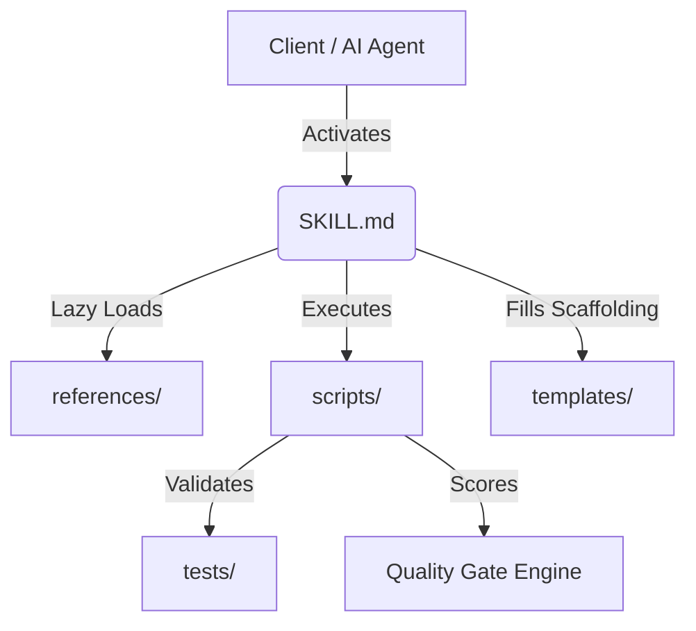

# Architecture Specification Document (ASD)

## 1. Executive Summary
Overview of system architecture, technology choices, and design rationale.

---

## 2. High-Level Architecture Diagram

---

## 3. Data & Directory Contracts
Detailed layout of directory schemas, file interfaces, and API contracts.

---

## 4. Key Architectural Decisions (ADRs)
- **ADR-0001**: 9-Directory Mandatory Structure.
- **ADR-0002**: SemVer 2.0.0 for Skill Evolution.
