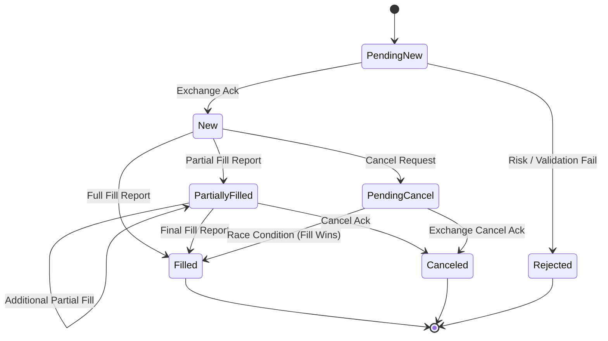
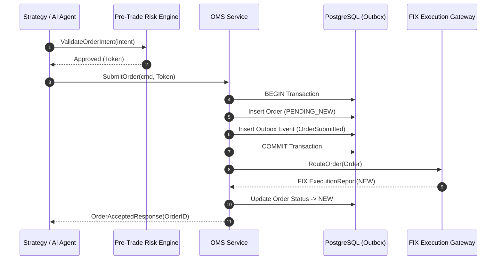

# Worked Example: Order Management System (OMS) Low-Level Design (LLD)

## 1. Overview
Detailed low-level design for the Order Management System (OMS), covering state machine transitions, package layout, internal interfaces, database schema, sequence diagrams, and concurrency strategy.

---

## 2. Order State Machine & Component Responsibilities



---

## 3. Package & Folder Structure

```
pkg/oms/
├── domain/
│   ├── order.go          # Core Order Aggregate & State Machine
│   ├── event.go          # Domain Events (OrderCreated, OrderFilled)
│   └── repository.go     # Repository Interface
├── usecase/
│   ├── submit_order.go   # Submit Order Command Handler
│   └── cancel_order.go   # Cancel Order Command Handler
└── infrastructure/
    ├── postgres_repo.go  # GORM / pgx PostgreSQL Repository
    └── kafka_producer.go # Confluent Kafka Producer Adapter
```

### Domain Entity Code Blueprint
```go
package domain

import (
	"errors"
	"time"
)

type OrderStatus string

const (
	StatusPendingNew OrderStatus = "PENDING_NEW"
	StatusNew        OrderStatus = "NEW"
	StatusFilled     OrderStatus = "FILLED"
	StatusRejected   OrderStatus = "REJECTED"
)

type Order struct {
	ID        string
	AccountID string
	Symbol    string
	Price     float64
	Qty       float64
	FilledQty float64
	Status    OrderStatus
	CreatedAt time.Time
}

func (o *Order) ApplyFill(fillQty float64, fillPrice float64) error {
	if o.Status != StatusNew && o.Status != StatusPendingNew {
		return errors.New("cannot fill order in current status")
	}
	o.FilledQty += fillQty
	if o.FilledQty >= o.Qty {
		o.Status = StatusFilled
	}
	return nil
}
```

---

## 4. Sequence Diagrams & Interaction Logic



---

## 5. Database & State Interaction
- Primary relational table: `orders` and `outbox_events`.
- Transaction isolation: Read Committed with optimistic locking version check.

---

## 6. Error Handling & Retry Strategies
- Validation errors return 400/InvalidArgument immediately.
- Database transient connection failures retry up to 3 times with exponential jitter backoff.

---

## 7. Testing Strategy
- Unit tests for domain state machine.
- Integration tests using Testcontainers PostgreSQL.
- Benchmark tests verifying sub-500 microsecond order creation latency.

---

## 8. Trade-off Analysis Rationale
- Using transactional outbox over direct Kafka publish to guarantee zero lost order events upon application crashes.
