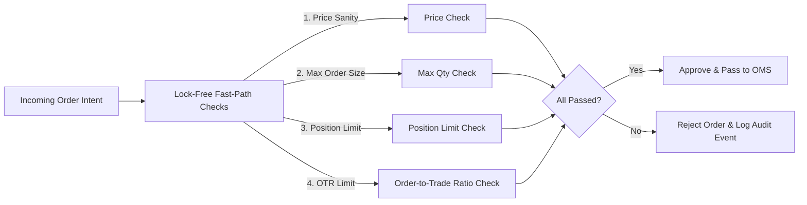

# Worked Example: Pre-Trade Risk Engine High-Level & Low-Level Design (HLD & LLD)

## 1. Overview
The Pre-Trade Risk Engine is a critical sub-millisecond line-of-defense component that intercepts every order before transmission to execution venues.

## 2. Ultra-Low Latency Architecture

## 3. Performance & Memory Blueprint
- Written in C++20 / Rust with zero memory allocation on critical check path.
- State storage: In-memory arrays indexed by `AccountID` and `SymbolID` for $O(1)$ constant time evaluation.
- Micro-benchmark Target: $p99.9 < 15\mu\text{s}$.
