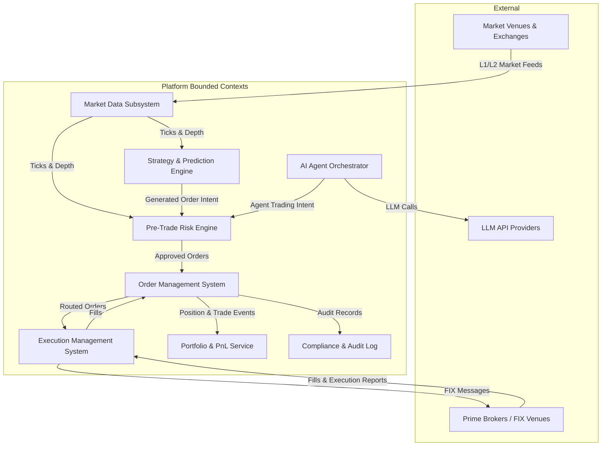

# Worked Example: Enterprise Quantitative Trading Platform High-Level Design (HLD)

## 1. Executive Summary & Context
This document specifies the end-to-end High-Level Design for our quantitative trading platform, enabling real-time market data ingestion, algorithmic strategy execution, AI-driven signal generation, pre-trade risk management, order lifecycle management, and portfolio accounting.

---

## 2. System Architecture & Context Boundaries

### 2.1 Market Data Subsystem (MDS)
- Ingests raw binary data (ITCH/OUCH, SBE) from exchanges.
- Normalizes feeds into unified Tick formats.
- Publishes ticks over zero-copy shared memory to local consumers and Kafka for downstream storage.

### 2.2 Pre-Trade Risk Engine
- Runs synchronous sub-100 microsecond risk checks (Max order size, account margin, symbol limits, OTR).
- Rejects orders violating risk policies before reaching OMS.

### 2.3 Order Management System (OMS)
- Owns order state lifecycle (`PendingNew` -> `New` -> `Filled` / `Canceled`).
- Ensures atomic durability using Transactional Outbox pattern on PostgreSQL.

### 2.4 Execution Management System (EMS)
- Manages FIX engine sessions and Smart Order Routing (SOR).
- Executes TWAP/VWAP algorithmic sliced orders.

---

## 3. Technology Stack Choice Matrix

| Layer | Selected Tech | Rationale |
| :--- | :--- | :--- |
| **Market Ingestion / FIX Gateway** | C++20 / Go | Maximum throughput, zero garbage collection pauses on critical path. |
| **OMS & Risk Engine** | Go / Java (ZGC) | Low deterministic latency ($< 500\mu\text{s}$) with high developer productivity. |
| **Strategy & AI Inference** | Python / PyTorch / ONNX | Ecosystem richness for quant models and LLM agent integration. |
| **Primary Transaction DB** | PostgreSQL 16 | ACID compliance, transactional outbox support. |
| **Tick / Analytical Storage** | ClickHouse | Columnar time-series store capable of querying 10B+ ticks/sec. |
| **Event Bus** | Apache Kafka | In-order delivery per symbol/account partition, 7-year audit retention. |

---

## 4. Security Strategy
- AuthN/AuthZ via OAuth2/OIDC and fine-grained RBAC.
- Zero-Trust mTLS for internal service-to-service communication.
- Hardware Security Module (HSM) for broker API keys.

---

## 5. Scalability Strategy
- Horizontal scaling of Market Data Feed Handlers per venue.
- Partitioned Kafka event stream by ticker symbol and account ID.

---

## 6. Reliability & High Availability Strategy
- Active-Passive deployment for OMS write primary with hot standbys.
- Circuit breakers on external broker FIX lines.

---

## 7. Observability Strategy
- OpenTelemetry tracing across order submission pipeline.
- Golden Signals tracked via Prometheus and Grafana.

---

## 8. Trade-off Analysis & ADR Rationale
- **Trade-off**: Preferring Modular Monolith with shared memory for Risk Engine rather than independent microservices to achieve sub-100 microsecond latency budget.

---

## 9. Risk Analysis & Failure Mitigation
| Failure Mode | Impact | Probability | Mitigation Strategy |
| :--- | :---: | :---: | :--- |
| Broker FIX Line Disconnect | High | Medium | Automatic failover to secondary backup FIX session |
