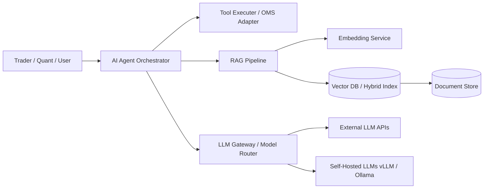

# AI System Architecture, LLM Services & RAG Reference Guide

## 1. Overview
This reference guide provides architectural standards for integrating AI/ML models, Large Language Models (LLMs), Retrieval-Augmented Generation (RAG), Vector Databases, and Autonomous AI Agents into an enterprise quantitative trading platform ecosystem.

---

## 2. Core AI Component Patterns

---

## 3. RAG Architecture Standards

### 3.1 Data Ingestion & Indexing Pipeline
1. **Document Parsers**: Support financial PDFs, earnings reports, regulatory filings (10-K, 10-Q), news feeds, and quantitative research papers.
2. **Chunking Strategy**: Semantic chunking based on domain boundaries (financial table aware, recursive character splitting with overlap).
3. **Embedding Generation**: Dedicated embedding models (e.g. `bge-large-en`, `text-embedding-3-large`).
4. **Vector Database Strategy**:
   - Hybrid Search: Combine Dense Vector Search (HNSW / Cosine Similarity) with Sparse Keyword Search (BM25 / Full-Text Search).
   - Storage Engines: Qdrant / Milvus / pgvector depending on workload size and relational JOIN requirements.

### 3.2 Retrieval & Reranking Strategy
- **Query Rewriting**: Multi-query generation, HyDE (Hypothetical Document Embeddings) for complex quant questions.
- **Reranking Engine**: Cross-encoder reranker (`bge-reranker-large`) to score top-50 retrieved candidates down to top-5 high-relevance passages.
- **Context Construction**: Dynamic context window management with token counting, metadata filtering (e.g. ticker symbol, release date, asset class).

---

## 4. LLM Service & Model Serving Gateway

### 4.1 Gateway Responsibilities
- **Model Routing**: Dynamic routing between fast/cost-efficient models (e.g. Gemini Flash) and high-reasoning models (e.g. Claude 3.5 Sonnet / Pro models) based on query complexity.
- **Rate Limiting & Token Budgeting**: Per-user / per-team quota management.
- **Caching Layer**: Semantic Prompt Caching via Redis to bypass LLM inference for duplicate/similar quantitative queries.
- **Fallbacks & Circuit Breakers**: Automatic failover to secondary model providers if primary API experiences elevated latency or errors.
- **Structured Output Enforcement**: Enforce JSON schema validation (Pydantic / Instructor) on all LLM responses before passing to downstream systems.

---

## 5. Agent Architecture & Tool Integration

### 5.1 Trading Agent Framework
- **State Machine**: ReAct (Reasoning + Acting) or Plan-and-Execute loops with strict max-step thresholds to prevent infinite loops.
- **Tool Calling Contracts**:
  - Every tool function must have a strict Pydantic JSON schema.
  - Safe Tools (Read-only: `get_portfolio_pnl`, `fetch_order_status`, `query_market_data`).
  - Restricted Tools (Mutative: `submit_order`, `cancel_order`, `adjust_risk_limit`). Restricted tools **require human-in-the-loop (HITL) approval** or explicit risk engine clearance.
- **Guardrails**:
  - Input Guardrails: Prompt injection detection, PII filtering.
  - Output Guardrails: Financial sanity checks, hallucinated ticker validation, compliance boundaries.
