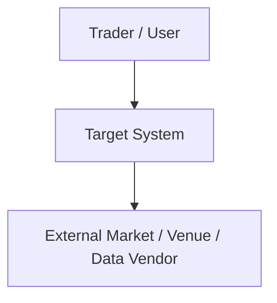
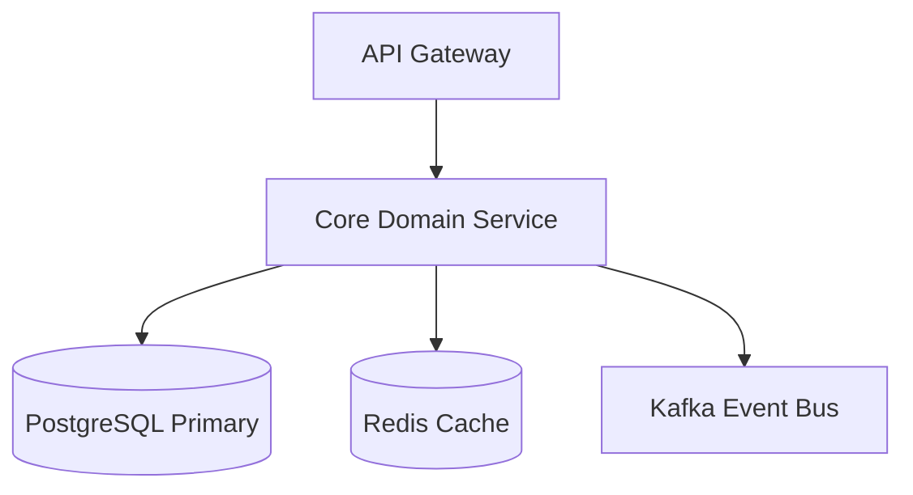

# High-Level Design (HLD) Document: [System/Subsystem Name]

## 1. Document Control & Metadata
- **System Name**: [System Name]
- **Author**: [Author / Lead Architect]
- **Status**: [Draft / Under Review / Approved]
- **Version**: [1.0.0]
- **Date**: [YYYY-MM-DD]
- **Target Audience**: Engineering Leads, Systems Architects, Product Owners

---

## 2. Executive Summary & Business Context
- **Overview**: Brief description of the system and its primary business function.
- **Business Drivers & Goals**: Key business objectives driving this architecture.
- **Scope & Out of Scope**: Clear boundaries of what is included and excluded.

---

## 3. Architectural Principles & Philosophy
- **Philosophy**: Build simple. Scale when necessary. Prefer modular monoliths.
- **Key Principles**: [e.g., Low Latency, Zero SPOF, Hexagonal Architecture, Strict Idempotency]

---

## 4. System Architecture & Diagrams (C4 Level 1 & 2)

### 4.1 System Context Diagram (Level 1)

### 4.2 Container Diagram (Level 2)

### 4.3 Context Boundaries & Domain Decomposition
| Bounded Context | Core Responsibilities | Domain Entities | Interfaces Provided |
| :--- | :--- | :--- | :--- |
| [Context A] | [Responsibilities] | [Entities] | [gRPC / REST / Kafka] |

---

## 5. Technology Stack & Strategy

| Layer | Technology Selected | Justification & Alternatives Evaluated |
| :--- | :--- | :--- |
| **Language & Runtime** | [e.g. Go / C++ / Python] | [Rationale] |
| **API Framework** | [e.g. gRPC / FastAPI] | [Rationale] |
| **Primary Datastore** | [e.g. PostgreSQL] | [Rationale] |
| **Tick / Time-Series DB** | [e.g. ClickHouse] | [Rationale] |
| **Caching Layer** | [e.g. Redis Cluster] | [Rationale] |
| **Messaging Bus** | [e.g. Apache Kafka] | [Rationale] |

---

## 6. Major System Strategies

### 6.1 Security Strategy
- AuthN / AuthZ mechanisms.
- Data protection at rest and in transit.

### 6.2 Scalability & Performance Strategy
- Scaling approach (Horizontal / Vertical).
- Latency targets ($p50, p99, p99.9$).

### 6.3 Reliability, High Availability & Disaster Recovery
- Multi-AZ deployment, failover mechanisms, RTO/RPO limits.

### 6.4 Observability Strategy
- Logs, Metrics, Traces, Alerts.

---

## 7. Trade-off Analysis & Architectural Decision Records (ADRs)
- Summary of trade-offs made (e.g. Latency vs Consistency, Complexity vs Flexibility).

---

## 8. Risk Analysis & Mitigation
| Identified Risk | Impact (H/M/L) | Probability (H/M/L) | Mitigation Strategy |
| :--- | :---: | :---: | :--- |
| [Risk 1] | H | M | [Mitigation] |
