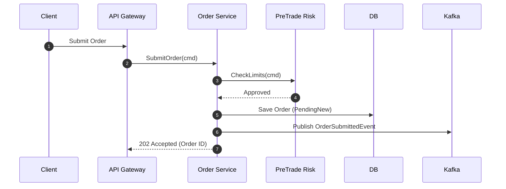

# Low-Level Design (LLD) Document: [Module/Component Name]

## 1. Metadata & Reference HLD
- **Module Name**: [Module Name]
- **Parent System / HLD**: [Link to HLD]
- **Author**: [Lead Engineer]
- **Status**: [Draft / Approved]

---

## 2. Package & Folder Structure
```
internal/
├── domain/
│   ├── entity.go
│   ├── repository.go
│   └── service.go
├── ports/
│   ├── inbound.go
│   └── outbound.go
├── adapters/
│   ├── postgres/
│   ├── kafka/
│   └── http/
└── config/
```

---

## 3. Internal Component & Class Design

### 3.1 Class / Struct Specifications
```python
# Example Class Definition
class OrderProcessor:
    def __init__(self, risk_client: RiskClient, repo: OrderRepository):
        self.risk_client = risk_client
        self.repo = repo

    def process_order(self, command: SubmitOrderCommand) -> OrderResult:
        pass
```

### 3.2 Component Responsibilities
| Component Name | Responsibility | Dependencies | State Managed |
| :--- | :--- | :--- | :--- |
| `OrderProcessor` | Coordinates order validation, risk check, and persistence | `RiskClient`, `OrderRepo` | None (Stateless) |

---

## 4. Sequence Diagrams & Interaction Logic


---

## 5. Database & State Interaction

### 5.1 Relational Database Schema
```sql
CREATE TABLE orders (
    order_id UUID PRIMARY KEY,
    account_id VARCHAR(64) NOT NULL,
    symbol VARCHAR(32) NOT NULL,
    side VARCHAR(8) NOT NULL,
    quantity NUMERIC(18, 8) NOT NULL,
    price NUMERIC(18, 8),
    status VARCHAR(32) NOT NULL,
    created_at TIMESTAMPTZ NOT NULL DEFAULT NOW()
);
```

---

## 6. Error Handling, Retry & Circuit Breakers
- **Validation Errors**: Return 400 Bad Request / gRPC `INVALID_ARGUMENT`.
- **Transient Errors**: Retry with exponential backoff and jitter (max 3 retries).
- **Non-recoverable Errors**: Dead Letter Queue (DLQ) publish + alert trigger.

---

## 7. Testing Strategy
- **Unit Tests**: Mock external adapters, 90%+ branch coverage for domain rules.
- **Integration Tests**: Test database queries against PostgreSQL via Testcontainers.
- **Performance / Benchmarks**: Micro-benchmarks for critical loops ($p99 < 100\mu\text{s}$).
